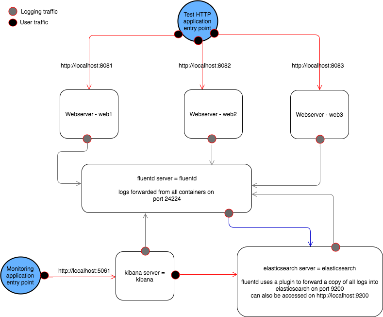

# Devops task for VGS

This project will spin up a small environment with 3 web servers.  All containers in the environment forward their logs to a centralized log server using fluentd.  Those logs are then copied to an elasticsearch server.  A kibana server is included to view the data.  

## Traffic flow:



## Pre-reqs

The machine where this is being run has a linux variant of Docker engine running and an internet connection.  This has only been tested on mac.

## To create the environment
```
git clone https://github.com/cestinger/vgs-tasks.git
cd devops-task
choose your environment:
  for prod - cp prod.env .env
  for dev - cp dev.env .env
  for the purposes of this document, we will assume the dev profile has been used
verify environment variables:
  docker-compose config
create local shared volumes:
  mkdir -p /tmp/elasticsearch/data
docker-compose build
docker-compose up -d
```

## To use the environment
```
You can view the site on each individual webserver container:
  http://localhost:8081
  http://localhost:8082
  http://localhost:8083
This will produce log traffic that can be viewed at:
  http://localhost:5601
    To view logs, go to Management, Index Patterns, fluentd-* is the pattern, @timestamp is the timestamp to use.
This will show you status of the elasticsearch server:
  http://localhost:9200
```

## To remove the environment
```
docker-compose down
docker-compose rm
```
